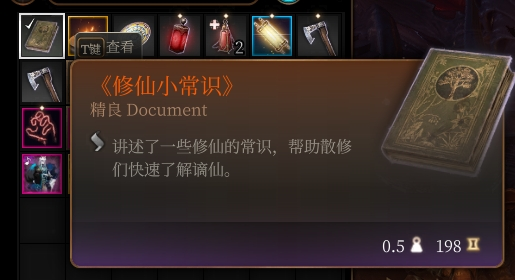
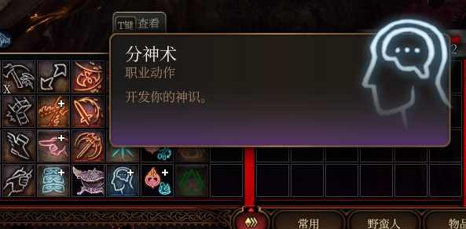
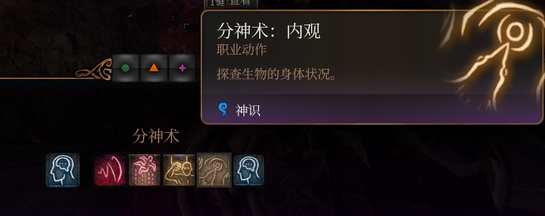

# 种族攻略

## 谪仙种族详解

!!! warning "注意"
    - 建议只主控选择谪仙。
    - 谪仙在人类亚种。
    - 末法时代和洪荒时代区别在于：洪荒时代每个敌人都能修仙，末法时代只能主控和队友修仙。想让队友也获得谪仙灵根可以喝活力药水。
    - 谪仙无法炼器请确保胚子是唯一装备！不然练完会直接变成你的炼器就绪层数。
    - 谪仙淬火难度必须是硬核以上。

!!! tip
    > **天灵根之说：**传闻灵根至极境，可蜕变为天灵根，威能较寻常灵根强盛十倍有余。

    > **逆天改命之术：**若灵根混沌未显异象，可择：

    > **夺灵大法** - 强取他人灵根补己之缺。

    > **五行金丹** - 以丹道重塑灵根本源。

    > 然天道有常，逆天而行必遭反噬，慎之慎之。

!!! tip
    **修仙宝术 - 时光洪流**：洪荒时代，大道煌煌，众生皆可悟道修行；末法时代灵气枯竭，唯天命者可修。

### 分神术

- **夺灵**：夺取觉醒灵根且无法反抗的类人生物的灵根
- **担山**：操控敌人随意摆弄，扔地上倒地1回合，沉重物体造成更大伤害
- **掌日**：消耗神识上限，操控傀儡（神识由感知加值决定）
- **内观**：查看自身与队友的资质、大道、灵根、修为
- **洞观**：查看范围内非友方灵根和修为等状态

### 大道与修为

!!! tip
    - 修为在长休和短休后增长，低于一年的修为不提供增益。
    - 灵根资质越高，每次休息收益越高。
    - 不同大道有不同快速增长方式。
    - **如果长休没加修为，99%是因为道心不稳**，请检查是否换了大道后残留了旧道痕。

#### 修罗道

**核心机制：物理伤害 + 击杀**

| 项目 | 详情 |
| --- | --- |
| 修为获取 | 造成伤害（斩击/穿刺）且道心稳定时，触发信号；击杀目标时额外增加修为 |
| 击杀奖励 | 增加天数 = 目标等级 × 灵根资质 |
| 附加效果 | 暴击给目标挂流血；已流血则延长2回合；击杀回血 |
| 仙人模式 | 斩击/穿刺攻击最小骰值锁定20（几乎必中/大伤害） |

!!! warning
    必须有实际伤害的斩击或穿刺攻击才会触发，法术伤害不算。

#### 饿鬼道

**核心机制：吞食 + 偷取状态**

| 项目 | 详情 |
| --- | --- |
| 修为获取 | 使用【吞食】攻击命中后，吞食目标身上的增益状态，每个状态转化为天数增加修为 |
| 转化公式 | 吞食增加天数 = 被吞状态持续时间 + 自身当前修为天数 |
| 回血 | 同时恢复生命值 = 增加天数 × 6 |
| 附加效果 | 对野兽/怪兽等使用妖化版本吞食 |

!!! tip
    主要靠自己吞食队友或召唤物身上的Buff来刷修为。

#### 人间道

**核心机制：濒死保护 + 道痕积累**

| 项目 | 详情 |
| --- | --- |
| 修为获取 | 自身濒死（HP<1）被攻击时，给攻击者叠加道痕 |
| 本质 | 属于被动挨打积累道痕型，战斗越惨烈积累越快 |
| 附加效果 | 技能检定加值 = 修为年份 |
| 仙人模式 | 所有技能检定最小值锁定20（近乎必定成功） |

#### 畜生道

**核心机制：变身 + 回合制成长**

| 项目 | 详情 |
| --- | --- |
| 修为获取 | 变身后每回合结束增加天数 = 1 × 灵根资质 |
| 前提 | 必须处于变身状态且在战斗中 |
| 附加效果 | 变身期间增伤+减伤 = 修为年份；解锁专属变身技能 |
| 仙人模式 | 变身不消耗动作/附赠动作，零消耗变身 |

!!! tip
    **畜生道是回合制刷修为最稳定的流派之一**，只要一直变身战斗，每回合都在涨。

#### 地狱道

**核心机制：业火 + 击杀传递**

| 项目 | 详情 |
| --- | --- |
| 修为获取 | 给目标挂【业火】；当携带业火的目标死亡时，业火层数转化为增加天数 |
| 转化公式 | 增加天数 = 目标死亡时身上的业火层数 |
| 挂火方式 | 被近战攻击时反弹；自己造成火焰伤害时给目标挂 |
| 仙人模式 | 40尺光环：范围内带业火的敌人AC-1，且每回合受1点伤害；自身AC+1且回血 |

!!! tip
    堆火焰伤害频率，让尽量多的敌人带着业火死去。

#### 天道

**核心机制：杀孽判定 + 天劫**

| 项目 | 详情 |
| --- | --- |
| 修为获取 | 击杀【域外天魔（非LocalBorn）】增加天数 = 目标等级 |
| 惩罚机制 | 击杀【本地生灵（LocalBorn）】减少天数 = 目标等级，且附加"心悸"Debuff |
| 附加效果 | 解锁天雷打断；闪电法术无视抗性；天眼状态下击杀自动触发天罚 |
| 仙人模式 | 对带天痕/非LocalBorn的目标：无视所有抗性/免疫；每次攻击召唤天雷爆炸 |

!!! warning
    **天道是最难驾驭的大道**，杀错对象不仅不加修为，还倒扣+Debuff。建议只对邪魔、恶魔、亡灵等"域外"生物下死手。

#### 剑道

**核心机制：持剑攻击 + 剑意/剑气/振剑**

| 项目 | 详情 |
| --- | --- |
| 修为获取 | 使用剑类武器近战攻击命中时，增加天数 = 1 + 灵根资质 |
| 前提 | 必须装备剑类武器、熟练使用、近战攻击、不Miss |
| 剑意 | 每回合+1层（上限=修为年份+1），每层给武器伤害加值 |
| 剑气 | 命中时给目标挂剑气，下回合开始时造成（剑意层数+1）的斩击伤害 |
| 振剑 | 施法时根据法术等级积累振剑层数，攻击带剑气的目标可触发"振剑爆发" |
| 仙人模式 | 持剑时：斩击无视抗性/免疫；近战攻击射程变18尺（中距离剑仙） |

!!! tip
    当前版本力道攻击的修为获取条件存在运算符优先级Bug，但剑道的代码逻辑是正确的，修为获取稳定。

#### 力道

**核心机制：近战/徒手攻击 + 负重加成**

| 项目 | 详情 |
| --- | --- |
| 修为获取 | 近战/徒手攻击命中且不Miss时，增加天数 = 基础1 + 负重额外加成 |
| 负重加成 | 轻负重(+5) / 中负重(+10) / 超重(+20) |
| 前提 | 道心稳定 |
| 力量加成 | 修为年份直接加到力量属性上 |
| 仙人模式 | 伤害阈值减伤 = 修为年份；对力量低于你的目标一击必杀 |

!!! tip
    穿最重的甲，拿最重的武器，把负重堆到超重，每次攻击+20天，配合高频近战是刷修为最快的方式之一。

#### 合欢道

**核心机制：采补 + 魅惑控制**

| 项目 | 详情 |
| --- | --- |
| 修为获取 | 对魅惑/睡眠/支配等状态下的目标使用【阴阳调和】相关技能触发采补 |
| 采补公式 | 增加天数 = 目标等级 × (1 + 目标灵根资质)。若目标修为年份高于你，只能采补一半 |
| 特殊机制 | 可【征服】较弱目标成为永久随从；随从可替你承伤 |
| 魅力加成 | 修为年份直接加到魅力属性上 |
| 仙人模式 | 受到伤害的50%由随从分摊 |

!!! warning
    **合欢道是互动最复杂的大道**，需要频繁与NPC/敌人进行"互动"，且随从系统涉及阵营变更，建议单机体验。

#### 羿道

**核心机制：弓箭远程攻击**

| 项目 | 详情 |
| --- | --- |
| 修为获取 | 远程武器攻击命中时，增加天数 = 1 + 灵根资质 |
| 前提 | 必须装备弓箭、远程武器攻击、道心稳定 |
| 灵气变异 | 根据灵根变异类型，弓箭附加不同元素伤害：雷/冰/毒/无属性 |
| 核心技能 | 【独翎】射程×1.5，暴击阈值-2；【双飞】额外+1目标 |
| 仙人模式 | 当前版本可能无法激活完整仙人模式 |

### 道心不稳：谪仙最致命的机制

!!! danger
    **道心不稳是修为增长完全停止的罪魁祸首**，如果你发现长休后修为没涨，99%是这个问题。

!!! tip
    **唯一触发原因：**道痕与当前大道不匹配。

    - 你原来修的是A道，积累了A道的道痕
    - 后来你换成了B道（或通过某种方式获得了B道被动）
    - 系统检测到你身上的道痕还是A道的，与当前B道不一致
    - **立刻施加"道心不稳"状态**，且只要道痕不匹配就会持续存在

!!! warning
    **常见误操作导致道心不稳：**

    - 使用洗点后大道被动被重置，但道痕还在。
    - 通过夺灵切换了大道被动。
    - 多人联机时数据同步异常。

!!! danger
    **道心不稳的后果：**

    - **修为增长完全停止**：长休/短休不加修为。
    - **所有大道战斗被动失效**：
      - 修罗道不加伤害、不挂流血。
      - 天道不触发天雷。
      - 剑心不叠剑意、不加剑气伤害。
      - 力道不加力量、攻击不加道行。
      - 畜生不变身不增伤。
      - 地狱道不挂业火。
      - 合欢道不触发采补。
      - 羿道不加射程不加伤害。
    - **道痕持续衰退**：每次触发道痕功能时，道痕年份-1；如果只剩1年道痕，直接清空并移除道心不稳。
    - **无法进入仙人模式**：所有仙人模式都要求道心稳定。

!!! tip
    **解决办法：**

    - **等它自然消退**：如果道痕只剩1年，下次触发道痕功能时会自动清空，道心不稳随之移除。
    - **手动移除道痕**：通过简易作弊小助手清除旧道痕状态。
    - **避免频繁换道**：确定主修大道后不要轻易更改。

### 灵根系统

!!! tip
    凡入道者皆可觉醒五行灵根。资质分三等：上品（十数灵根）、中品（数十灵根）、下品（翻身无望）。

**资质等级体系：**
- **平平无奇**（1-9 灵根资质）
- **先天慧根**（10-29 灵根资质）
- **大帝之姿**（30-49 灵根资质）
- **先天道体**（50 以上灵根资质）

#### 特殊灵根效果

| 灵根 | 效果 | 天灵根效果 |
| --- | --- | --- |
| 金 | 金属武器攻击优势，伤害取最高 | 必定命中且重击 |
| 木 | 治疗额外+1*境界骰 | 消除疲惫和负面 |
| 水 | 潮湿时速度翻倍，寒冷法术附赠动作 | 水面寒冷法术不消耗动作/附赠 |
| 火 | 火焰伤害+施法属性调整值 | 无视火焰抗性，低环法术不消耗法术位 |
| 土 | 受伤减少1*境界骰 | 再减少2*境界骰 |
| 雷 | 闪电抗性，重击-1，额外重击，减伤 | 无视闪电抗性，增伤，>5层最大伤害 |
| 血 | 近战吸血，法术施加流血 | 流血附加诅咒 |
| 冰 | 冰面攻击优势，攻击附加覆霜 | 冰冻持续至长休 |
| 风 | 反应+1，速度+3m，雷鸣抗性，免疫昏睡 | 动作+附赠+1 |
| 毒 | 攻击额外1*境界骰，自身也受伤，享受中毒 | 毒素取最大值 |
| 光 | 阳光下回复1*境界骰，满血提升属性 | 效果提升 |
| 暗 | 遮蔽下消耗反应使优势攻击重击 | 不再依赖优势 |
| 混沌 | 同时拥有五行效果，短休恢复长休资源 | 无 |

#### 天灵根配比公式

| 灵根 | 配比 |
| --- | --- |
| 金 | 金:10 |
| 木 | 木:10 |
| 水 | 水:10 |
| 火 | 火:10 |
| 土 | 土:10 |
| 混沌 | 2：2：2：2：2 |
| 光 | 木:火:土 = 3:6:1 |
| 暗 | 金:木:水 = 3:1:6 |
| 毒 | 木:水:火 = 6:2:2 |
| 冰 | 水:土 = 8:2 |
| 风 | 木:土 = 4:6 |
| 雷 | 金:水 = 8:2 |
| 血 | 木:火 = 6:4 |

!!! tip
    **灵根调配篇：**夫天地造化，五行轮转，生生不息。修士调御灵根，当循天道至理：

    金生水、水生木、木生火、火生土、土生金

    如：一颗乌金丹可增加一点金灵根，相应土灵根会减少一点，没有至少一点土灵根则金灵根不会发生变化，以此类推。

!!! tip
    【灵根调配成功后不生效请长休或短休】

### 道行系统

- **1-4级** 初入仙途，引气入体（练气前期到练气巅峰）
- **5-8级** 筑基入道，脱胎换骨
- **9-12级** 金丹入腹，威震一方，腾云驾雾
- **13-20级** 破丹成婴，生杀予夺，元神出窍
- **21-40级** 碎元婴而元神显，掌一方天地
- **41-60级** 炼虚期，虚怀若谷炼造化
- **61-80级** 合体期，万法归元
- **81-95级** 大乘期，天人交感证混元
- **96-99级** 九渡雷劫淬仙体
- **100级** 勘破红尘，褪凡成仙

| 境界等级 | 境界骰 |
| --- | --- |
| 1级（练气前期） | 1d4 |
| 4级（练气巅峰） | 1d6 |
| 5级（筑基入道） | 2d6 |
| 8级（筑基巅峰） | 2d8 |
| 9级（金丹入腹） | 3d8 |
| 12级（金丹巅峰） | 3d10 |
| 13级（破丹成婴） | 6d10 |
| 15级（元婴中期） | 7d10 |
| 17级（元婴后期） | 8d10 |
| 19级（元婴巅峰） | 9d12 |
| 21级（碎婴显神） | 10d12 |
| 26级 | 20d12 |
| 31级 | 30d12 |
| 36级 | 30d20 |
| 41级（炼虚期） | 40d20 |
| 46级 | 60d20 |
| 51级 | 80d20 |
| 56级 | 90d20 |
| 61级（合体期） | 100d20 |
| 66级 | 200d20 |
| 71级 | 400d20 |
| 76级 | 800d20 |
| 81级（大乘期） | 1000d20 |
| 86级 | 2000d20 |
| 91级 | 4000d20 |
| 96级（渡劫期） | 1000d20 |
| 100级（真仙） | 10000d100 |

### 真火炼器

**炼器三要素：**

- **第一 炼器之根-火焰**：谪仙最开始只拥有凡火（1D4），某些天赋异禀解锁天火灵根可以让此火焰效果翻倍。第一章螺壳舰中boss札尔克携带着1D6的幽冥鬼火。
- **第二 炼器之体-器胚**：选择一件武器或者装备作为炼器的本体。必须是唯一性物品。装备分词条装备和技能装备两类，词条装备为最佳器胚。
- **第三 炼器之魂-养分**：每一件带有自己能力的武器装备都可以成为炼器的养料。词条可以完美炼化提取后附着胚体，技能可以炼化提取强化提升技能类胚体。

!!! tip
    游戏有数种神火，分别位于螺壳舰扎尔克、拉斐尔、复仇熔炉复仇侍卫、凯瑟里克索姆、安苏身上。击败后用真火灼烧获取。

!!! tip
    **炼器步骤**：真火灼烧材料 -> 淬火达到程度失去材料获得"炼器就绪"（持续=境界值+1回合）-> 真火灼烧胚子到过热 -> 再灼烧一次完成。胚子需为唯一性装备。

!!! tip
    **淬火需求**：普通12/精48/稀有108/珍奇192/传奇300层，宝材365层。

**炼器高级规则：**

- 获得炼器就绪状态后需在规定回合内将被动转移到胚子上，否则炼器失败。获取被动时，会根据已炼化的装备弹出抉择选项，你可以决定是否保留已炼化的被动。可保留的词条数等同于此时你剩余的"炼器就绪"层数，向下取整。
- 目前只可以将mod装备作为材料而不可以作为胚子，作为胚子无效。且作为胚子的装备需为唯一性装备。
- 火灵根使用真火时，额外施加淬火效率。

### 丹药配方

| 丹药 | 功效 | 配方 |
| --- | --- | --- |
| 碧藕金丹 | 大幅提高生命上限 | 碧藕小还丹x3 |
| 碧藕小还丹 | 提高生命上限 | 心脏+碧藕+玲珑内丹 |
| 九转金丹 | 凭空大幅涨进修为 | 九转小还丹x3 |
| 九转小还丹 | 凭空涨进修为 | 玲珑内丹x3 |
| 三花九子膏 | 免疫目盲 | 漱玉花+九叶灵芝草+玲珑内丹 |
| 太乙紫金丹 | 解锁更多高环法术位 | 太乙小还丹x3 |
| 太乙小还丹 | 解锁更多法术位 | 妖核+玲珑内丹x2 |
| 宝鳞丸 | 一日内受伤减少 | 龙胆+葛蕈+老山参 |
| 保命丹 | 一日内生命翻倍恢复所有 | 地涌金莲+火铃草+妖核 |
| 倍力丸 | 一日内触发重击掷骰 | 葛草+老山参+妖核 |
| 避凶药 | 一日内攻击掷骰劣势 | 碧藕+甘草+妖核 |
| 参势丸 | 一日内攻击掷骰增加 | 老山参+甘草+妖核 |
| 朝元膏 | 一日内解锁额外法术位 | 妖核+甘草+白僵 |
| 度瘴散 | 一日内免疫中毒 | 简易毒素+树珍珠+碧藕 |
| 伏虎丸 | 一日内伤害提升 | 紫芝+葛蕈+妖核 |
| 坚骨药 | 一日内受伤减少 | 龙胆+葛蕈+妖核 |
| 镜中丹 | 一日内高等隐形 | 地涌金莲+白僵+妖核 |
| 清凉散 | 一日内火焰免疫+免疫燃烧 | 碧藕+漱玉花+妖核 |
| 轻身散 | 一日内移动速度翻倍 | 紫芝+交梨+妖核 |
| 神霄散 | 一日内免疫震慑感电+额外闪电伤害 | 龙胆+碧藕+妖核 |
| 温里散 | 一日内寒冷免疫+免疫冰冻 | 火铃草+碧藕+妖核 |
| 延寿膏 | 提升生命上限 | 心脏+甘草+漱玉花 |
| 益气育 | 提升1点气点上限 | 交梨+甘草+妖核 |
| 登仙散 | 一日内动作附赠反应+1 | 交梨+九叶灵芝草+火枣 |
| 七返火丹 | 重置技能冷却 | 火铃草+火铃砂+火枣 |
| 聚珍伏虎丸 | 一日内伤害提升 | 紫芝+猴头菌+妖核 |
| 加味参势丸 | 一日内攻击掷骰优势 | 甘草+千年人+树珍珠 |
| 龙光倍力丸 | 重击-1骰+1，攻击+1，伤害+1 | 紫芝+老山参+猴头菌 |
| 九转还魂丹 | 濒死恢复所有生命+移除负面 | 九叶灵芝草+千年人参+猴头菌 |
| 乌金丹 | 提升毒素抗性+增强金灵根 | 金锭+烟粉包+玲珑内丹 |
| 无心药 | 提升体质+增强木灵根 | 心脏+铁中血+玲珑内丹 |
| 水玉丹 | 提升火焰抗性+增强水灵根 | 龙珠+碧藕+玲珑内丹 |
| 补阳丹 | 提升寒冷抗性+增强火灵根 | 火枣+千年人参+玲珑内丹 |
| 铁牛丹 | 力量+2+挥砍穿刺钝击抗性+不被迫移+增强土灵根 | 大力铁牛角+玲珑内丹x2 |

#### 炼丹采药技巧

!!! tip
    **采药小技巧：**非致命开关下击倒敌人可以摸一次尸体，再击杀之后可以再摸一次尸体，可以让爆率翻倍。

    植物类敌人可提升药材掉落概率，特殊宝材/药材有特殊掉落方式。

#### 炼妖真解

!!! tip
    **炼妖真解：**天地异种，皆蕴造化。以真火淬其尸骸，可炼本命精华。

- **眼魔**：5级眼魔可以炼化金色眼眸，9级黑色眼眸
- **牛头人**：9级牛头人可以炼化大力铁牛角
- **邪魔、提夫林、牛**有概率掉落妖生角，也可进行炼化

!!! tip
    炼妖有一定等级限制，小妖无精，大妖华华，具体等级请自行探索。

!!! tip
    **炼妖淬火层数需求：**7 x 7 x 等级

#### 宝材器纹详解

**大力铁牛角（器纹-铁角）：**

- 每当你获得临时生命值时，徒手攻击和武器伤害获得等同于临时生命值的加值
- 每当你获得临时生命值时，护甲等级额外获得+2
- 当你使用动作如潮时可以额外获得1个动作

**妖生角（器纹-妖角）：**

- 每回合一次，当你施展一个法术时，徒手攻击和近战武器的伤害掷骰+1并获得1点临时生命值，效果随法术等级提升
- 每回合一次，当你进入荒野形态时，伤害+1受到的伤害-1
- 法术位上限额外提升3点
- 攀上新高：法术位上限额外提升3点

**黑色眼眸（器纹-黑眸）：**

- 被这把武器击杀的生物会在一回合后转化为不死生物为你战斗
- 战斗中每回合结束时最大生命值提升1点，效果随等级提升
- 你控制的不死军团的攻击和最大生命值获得提升，效果随等级提升

**金色眼眸（器纹-金眸）：**

- 圣盾：下一次受到的伤害减少至1
- 发动武器攻击后，获得圣盾
- 获得圣盾时，若已有圣盾，则近战武器的伤害掷骰+1
- 当你治疗一个生物后，使其获得圣盾

**龙珠（器纹-龙珠）：**

- 武器攻击额外造成伤害
- 过量治疗提升器纹·龙珠的额外光耀伤害的骰面，最多提升4次
- 过量治疗：造成光耀伤害时，最小伤害骰+1，最多提升3次

**铁中血（器纹-铁血）：**

- 死亡轮盘：锁定一个目标，使其五回合以后即死，期间自身无法攻击和移动
- 发动武器攻击时损失自身10点生命值并提升等量伤害
- 当你在你的回合被攻击后，回溯该伤害，并获得+1伤害
- 施展一道法术时，你可以以消耗生命值为代价代替法术位消耗，每一环法术位消耗增加10%最大生命值

**玉垂牙（器纹-玉牙）：**

- 每回合一次，武器攻击造成重击时，恢复偷袭骰
- 每回合一次，武器攻击造成重击时，恢复移动速度
- 每回合一次，武器攻击造成重击时，恢复附赠动作

**震雷骨（器纹-雷骨）：**

- 法术迸发：下一次武器攻击伤害触发三次（武器部位）
- 法术迸发：下一次攻击额外造成伤害（护甲部位）
- 法术迸发：下一个法术额外获得两个可瞄准目标（饰品部位）

#### 合欢道修仙小贴士

!!! warning
    **合欢道修仙小贴士：**征服可以消耗修为直接征服一个修为比你低的敌人为你所用成为你的仆从，且可以随你传送。用的好妙用无穷，切记勿要征服关键剧情人物，极易翻车！

## 死亡遗产详解

!!! warning
    起源谜团与种族死生者在血量低的时候可能会疯狂，这个被动无法去掉，介意就别选这两个。

    谜团从教程宝箱拿专属戒指可以用队友临时移除疯狂，也可以点封神的专长免疫疯狂。

!!! tip
    邪念起源+死生者种族 = 以提夫林为基础外观的强化版邪念，带额外初始能力和剧情能力。

!!! tip
    谜团起源+任意种族 = 邪念起源+死生者种族。谜团可以关闭邪念主线（开就是邪念，关就是塔夫），但别频繁开关。
